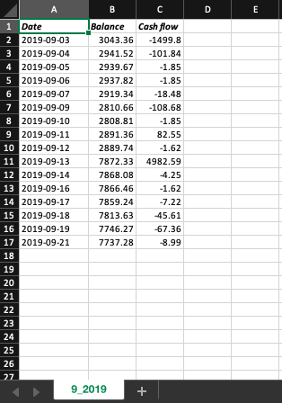

# my_financial_bot
A bot to track your real-time daily expenses

## Why?
I created this bot because I wanted to be able to REALLY track my expenses even from months back since most banks only provide the transactions of the last 30 days. With this bot I am able to track expenses of a life-time accounting for every single transaction I make. Besides that, I am able to manipulate the data the however I wish in the future and plan ahead.

## Usage:
Feel free to use it for yourself! That's why I created this config.py file.
You first need to create a [plaid account](https://plaid.com/). Plaid is a company that provides their users with their bank information without the need of you going through the pain of scraping the bank's website. 

Once you have a plaid account go ahead and get your plaid credentials on your dashboard. Once you have those, update the config.py file accordingly. 
Make sure your excel file looks like the template file.

## Requirements:
You will need to install the following libraries, the other ones are already provied by python:
* xlsxwriter
* plaid

## How it will look like:

